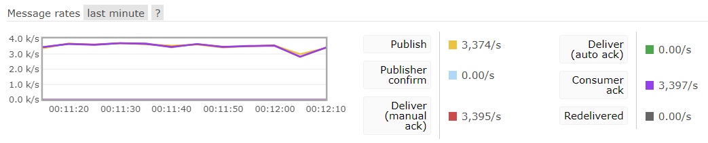

# Rabbit MQ Producer
> **mq 설치 및 Consumer 서버를 동작 후 Producer 실행**

* RabbitConfiguration : 기본 설정
* RabbitMessage : 주고 받을 객체
* RabbitMessageProducer : 송신 서비스
    * 서버가 시작되면 비동기로 설정한 횟수만큼 객체를 생성하여 전송
        * 100만번을 실행해도 유량 조절이 되면서 무리 없이 처리
         
    * @Scheduled 을 이용하여 주기적으로 전송 가능 
* application.yml : 기본포트와 연결할 rabbitmq 정보